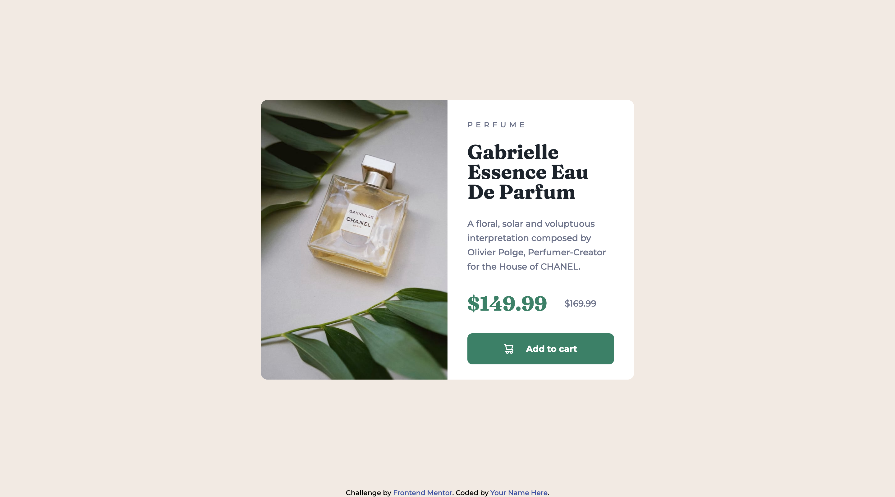

# Frontend Mentor - Product preview card component solution

This is a solution to the [Product preview card component challenge on Frontend Mentor](https://www.frontendmentor.io/challenges/product-preview-card-component-GO7UmttRfa). Frontend Mentor challenges help you improve your coding skills by building realistic projects.

## Table of contents

- [Overview](#overview)
  - [The challenge](#the-challenge)
  - [Self assigned challenges](#self-assigned-challenges)
  - [Screenshot](#screenshot)
  - [Links](#links)
- [My process](#my-process)
  - [Built with](#built-with)
  - [What I learned](#what-i-learned)
- [Author](#author)

## Overview

### The challenge

Users should be able to:

- View the optimal layout depending on their device's screen size

### Self assigned challenges

- Use BEM to organise CSS.

### Screenshot

### Links

- [Solution URL](https://www.frontendmentor.io/solutions/product-preview-card-component-QhnKjySSJN)
- [Live Site URL](https://sh-product-preview-card.netlify.app)

## My process

### Built with

- Semantic HTML5 markup
- CSS custom properties
- Flexbox
- CSS Grid

### What I learned

- Not a lot, just wanted to blast something out quick quick to shake off the rust!

## Author

- Website - [Sam Hemingway](https://samhemingway.dev)
- Frontend Mentor - [@SamHemingway](https://www.frontendmentor.io/profile/samhemingway)
